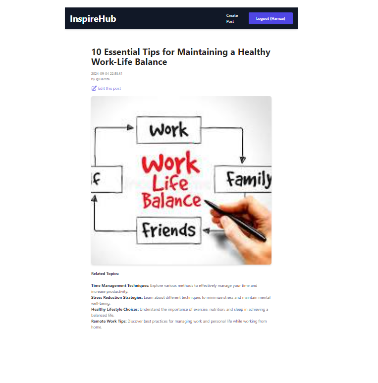
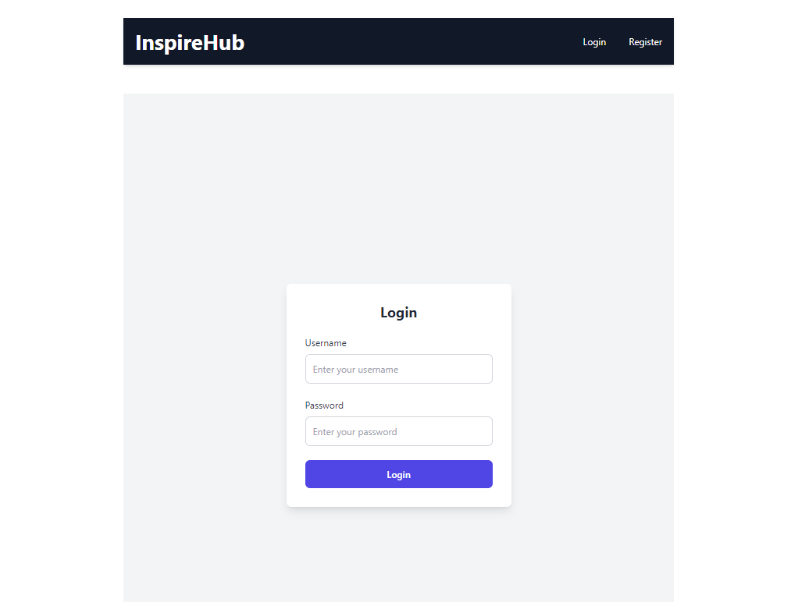

# InspireHub

A full-stack blogging platform built with the MERN stack. Register, sign in, and write posts with a rich text editor, image uploads, and JWT-based authentication.


## Features

- **JWT authentication** with httpOnly cookies for session handling.
- **Rich text editor** (ReactQuill) for writing posts with formatting, not just plain text.
- **Image uploads** on posts, handled server-side with Multer.
- **Full post CRUD**: create, edit, and delete your own posts.
- Responsive UI built with Tailwind CSS.



## Tech Stack

**Frontend:** React, Redux, Tailwind CSS, ReactQuill
**Backend:** Node.js, Express, MongoDB (Mongoose), JWT, Multer, bcrypt



## Getting Started

### 1. Clone and install

```bash
git clone https://github.com/SyedHamza-Dev/Mern_Blog_project.git
cd Mern_Blog_project

cd api && npm install
cd ../client && npm install
```

### 2. Set up environment variables

Create `api/.env`:

```
MONGODB_URI=your_mongodb_connection_string
JWT_SECRET=your_jwt_secret
```

### 3. Run it

```bash
# terminal 1, from api/
node index.js

# terminal 2, from client/
npm start
```

Open [http://localhost:3000](http://localhost:3000).

## Project Structure

```
Mern_Blog_project/
├── api/            # Express backend, models, image uploads
└── client/         # React frontend
```
